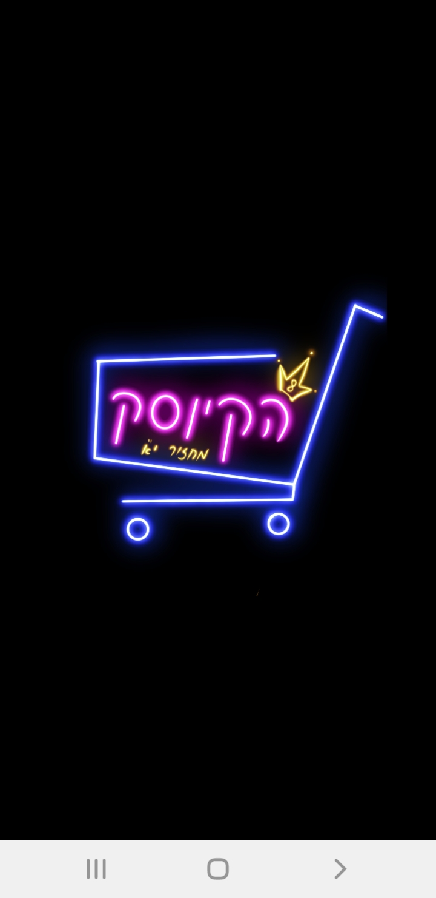
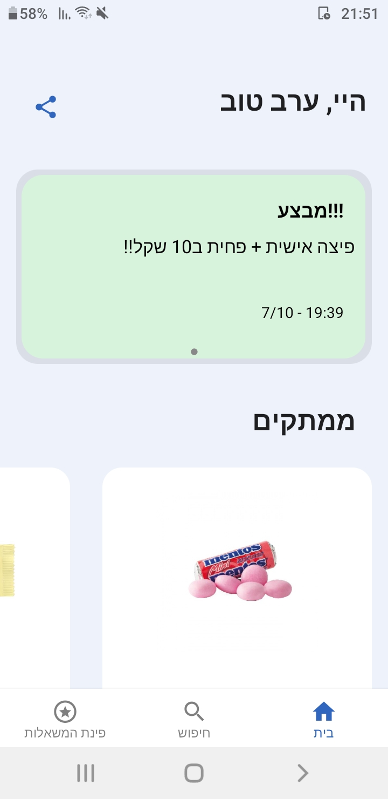
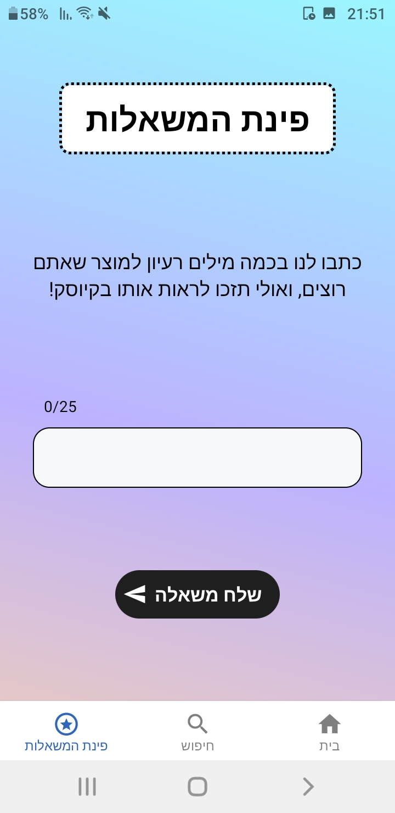
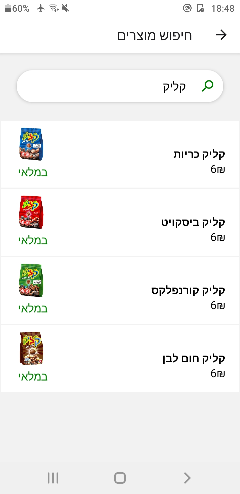
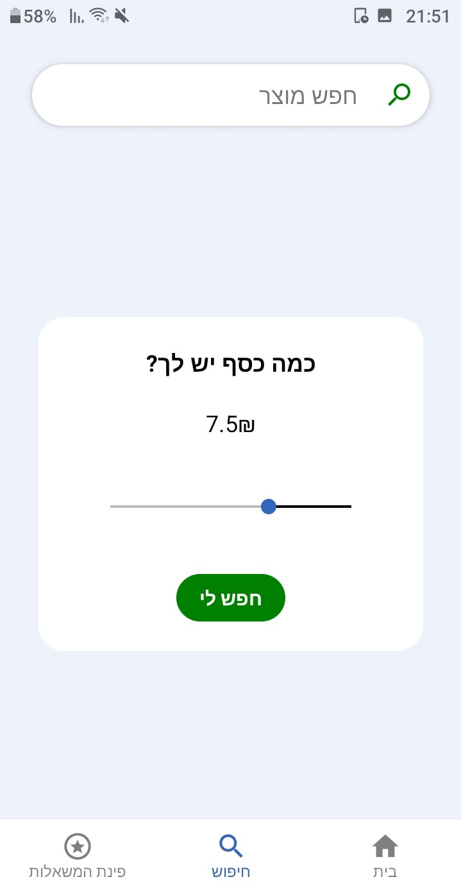
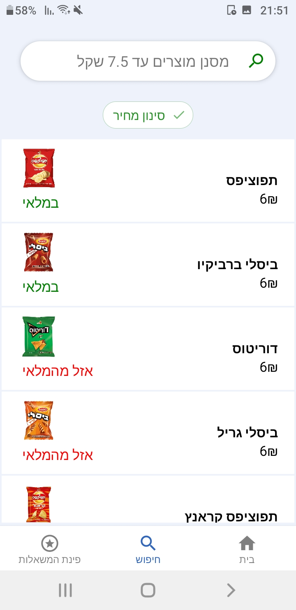

# Kiosk

  

## 📌 About the Project
Kiosk is a mobile application designed to provide small kiosks and convenience stores with an affordable solution for displaying their products. The app allows store owners to update prices in real time and send push notifications to users about discounts and promotions.

Originally, this project was developed as a pilot application for the local kiosk at my high school, aiming to modernize product displays and streamline price updates efficiently.

## 🚀 Features
- **Product Catalog Display** – Showcase all store products in an easy-to-browse interface.
- **Real-Time Price Updates** – Modify product prices instantly.
- **Push Notifications** – Notify users about special offers and discounts.
- **Cloud Storage** – Firebase ensures secure and scalable data and image storage.

## 📷 Screenshots

  
  
    
  
  
  

## 🛠 Tech Stack
- **React Native & TypeScript** – The app is built with React Native using TypeScript for type safety and scalability.
- **Expo** – Simplifies development, deployment, and testing.
- **Firebase** – Used for real-time data storage and image hosting.

---
Stay tuned for updates and improvements! 🚀

